# React Portfolio

## Table of Contents

- [Description](#description)
- [User Story](#user-story)
- [Acceptance Criteria](#acceptance-criteria)
- [Screenshots](#screenshots)
- [Contact Me](#contact-me)
- [My Development Environment](#my-development-environment)
- [Languages, Technologies and Packages used](#languages-technologies-and-packages-used)

## Description

Being a web developer means being part of a community. I need a place not only to share your projects while you're applying for jobs or working as a freelancer but also to share my work with other developers and collaborate on projects.

Using my new and ever growing React skills, I've created an updated portfolio and have delployed it to GitHub pages.

This new portfolio is built in React and features Sanity CMS acting as a backend Content Management System to allow for easy maintenance and updating of content in the future. The site also features extensive use of the Framer Motion animation library to add a sense of movement, dynamism and polish to the entire site.

Having used Three.JS on my previous portfolio site, I wanted to push myself even further with this latest project; to learn some new front end tools and technologies to go alongside my growing skillset in React, and i am proud of the end result here.

## User Story

```md
AS AN employer looking for candidates with experience building single-page applications
I WANT to view a potential employee's deployed React portfolio of work samples
SO THAT I can assess whether they're a good candidate for an open position
```

## Acceptance Criteria

```md
GIVEN a single-page application portfolio for a web developer
WHEN I load the portfolio
THEN I am presented with a page containing a header, a section for content, and a footer
WHEN I view the header
THEN I am presented with the developer's name and navigation with titles corresponding to different sections of the portfolio
WHEN I view the navigation titles
THEN I am presented with the titles About Me, Portfolio, Contact, and Resume, and the title corresponding to the current section is highlighted
WHEN I click on a navigation title
THEN I am presented with the corresponding section below the navigation without the page reloading and that title is highlighted
WHEN I load the portfolio the first time
THEN the About Me title and section are selected by default
WHEN I am presented with the About Me section
THEN I see a recent photo or avatar of the developer and a short bio about them
WHEN I am presented with the Portfolio section
THEN I see titled images of six of the developer’s applications with links to both the deployed applications and the corresponding GitHub repositories
WHEN I am presented with the Contact section
THEN I see a contact form with fields for a name, an email address, and a message
WHEN I move my cursor out of one of the form fields without entering text
THEN I receive a notification that this field is required
WHEN I enter text into the email address field
THEN I receive a notification if I have entered an invalid email address
WHEN I am presented with the Resume section
THEN I see a link to a downloadable resume and a list of the developer’s proficiencies
WHEN I view the footer
THEN I am presented with text or icon links to the developer’s GitHub and LinkedIn profiles, and their profile on a third platform (Stack Overflow, Twitter)
```

## Screenshots

The following animation shows the web application's appearance and functionality:


### Back End Content Management System Screenshots:

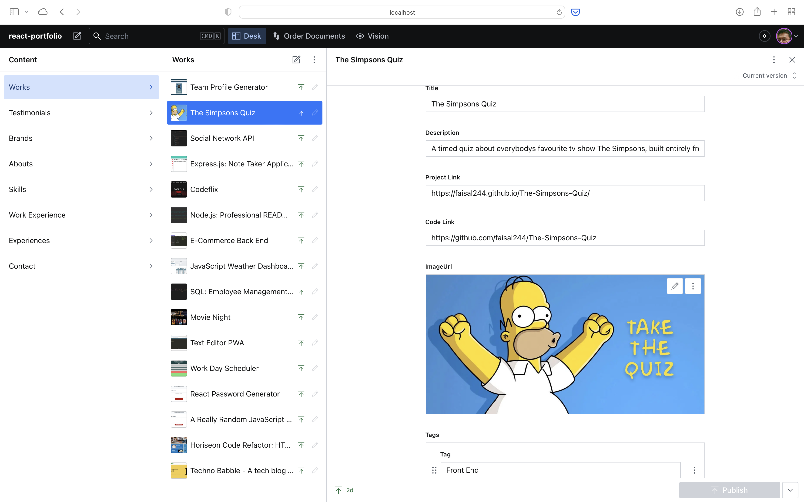

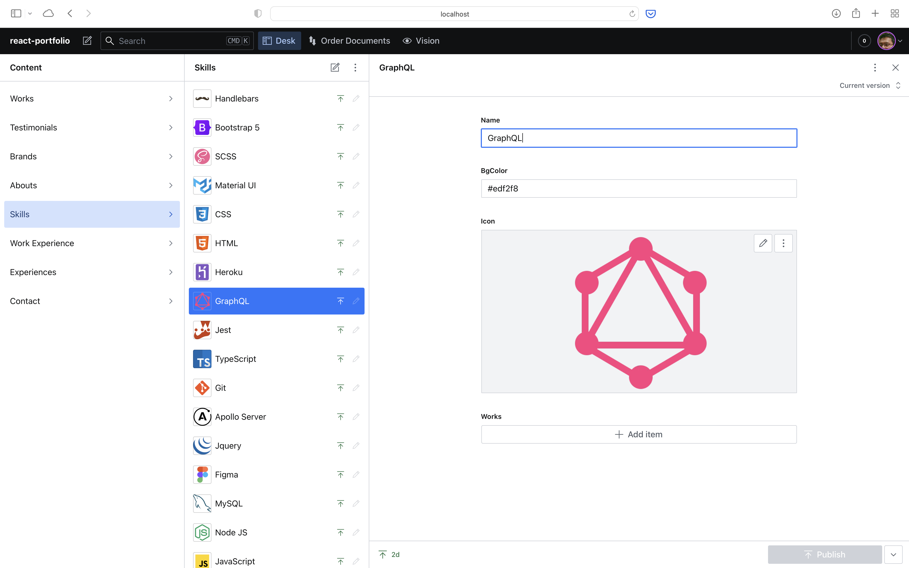

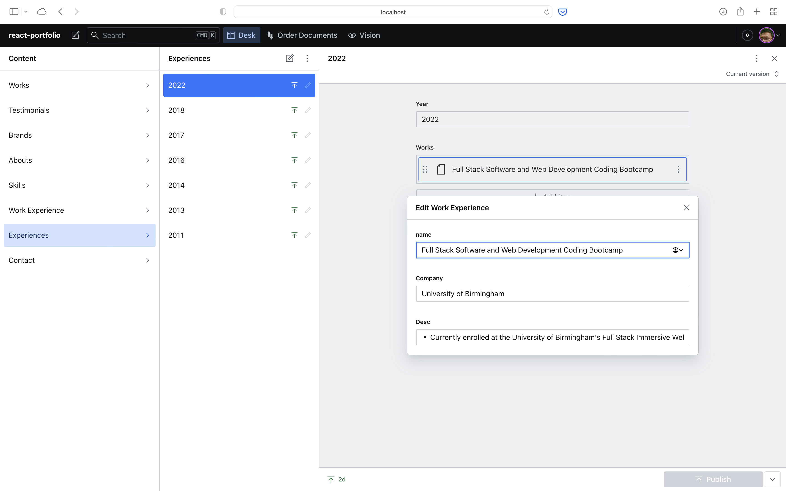

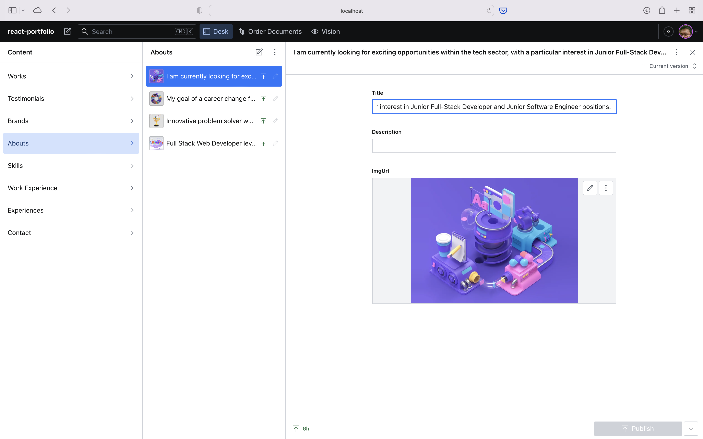

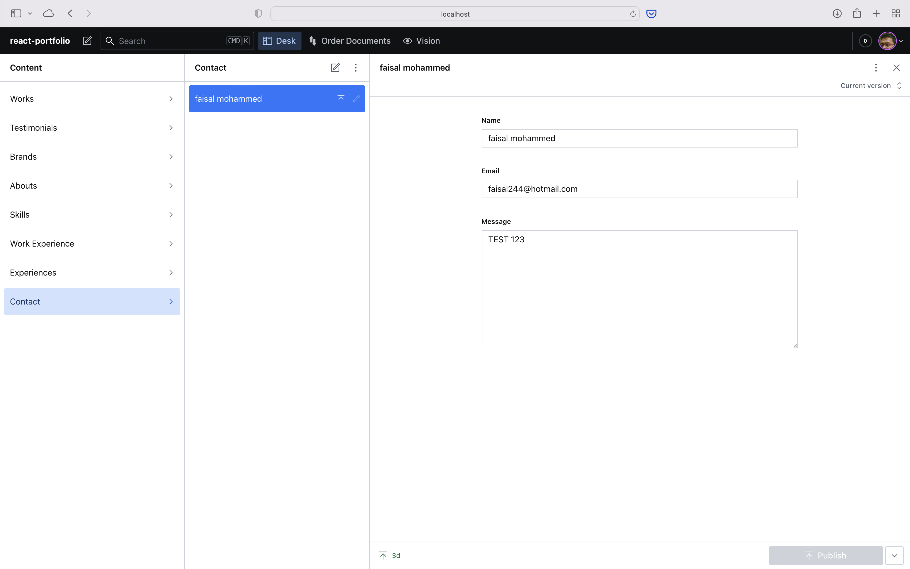

### Front End Screenshots:

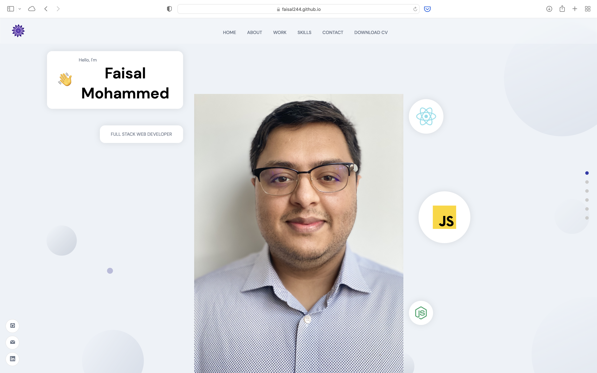

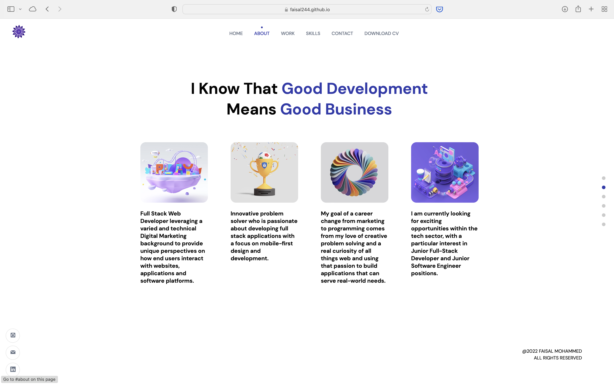

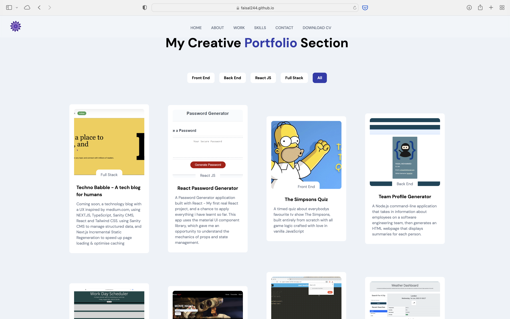

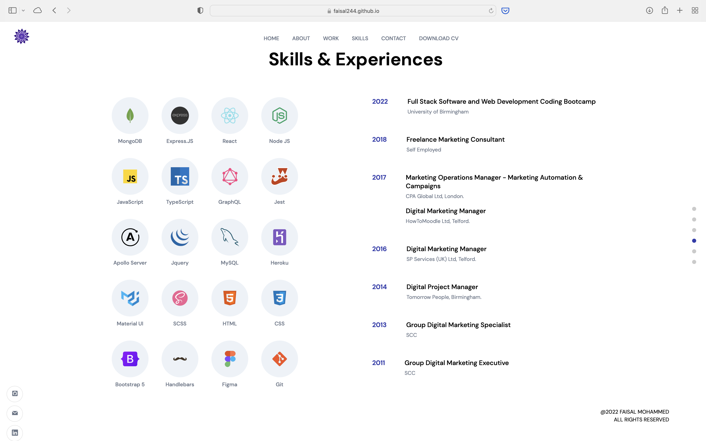

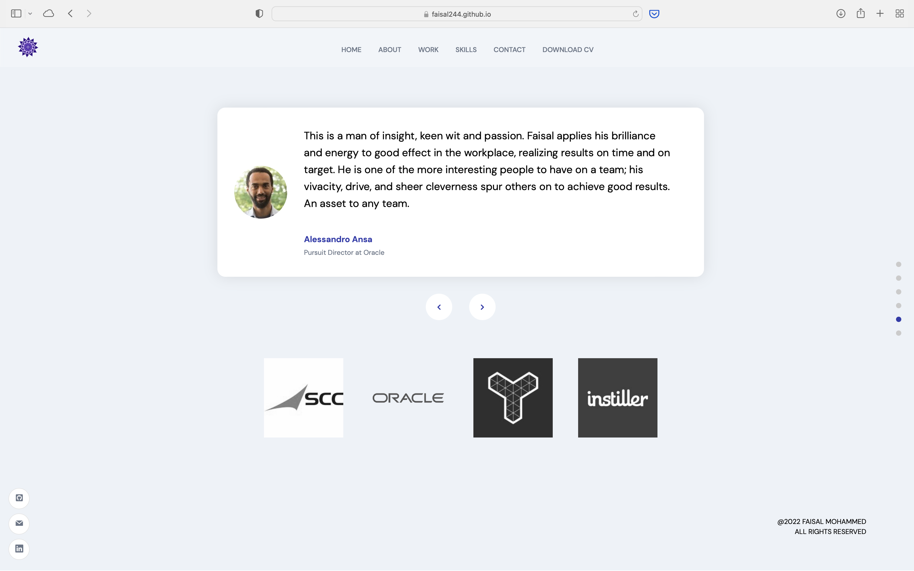

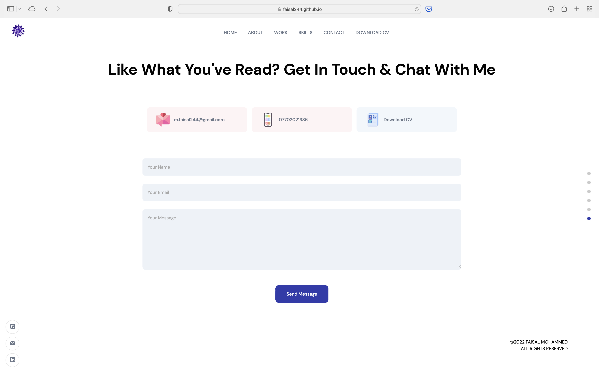

## Contact me

- Contact me by Email: [m.faisal244@gmail.com](mailto:m.faisal244@gmail.com)

- [Connect with me on linkedin](https://www.linkedin.com/in/faisal244/)

- [View my Portfolio](https://faisal244.github.io/react-portfolio/)

## My Development Environment

- VScode
- Terminal
- Nodemon
- MacOS Monterey
- Git
- Github

## Languages, Technologies and Packages used

- React
- Node.JS v18.7.0

- [NPM] Sanity CMS
- [NPM] Framer Motion
- [NPM] Sanity Image-url
- [NPM] material UI
- [NPM] React Icons
- [NPM] React Tooltip
- [NPM] Node Sass
- [NPM] Dotenv
- [NPM] GH Pages

---
